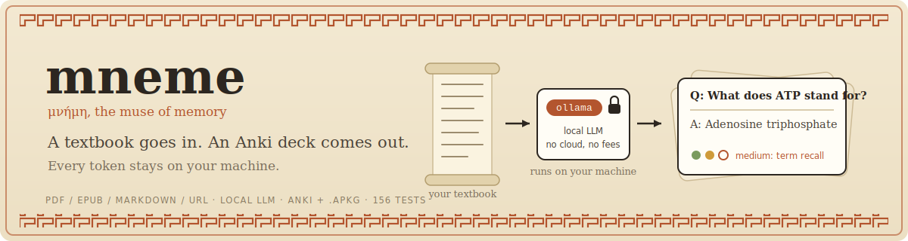
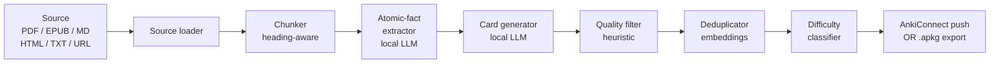
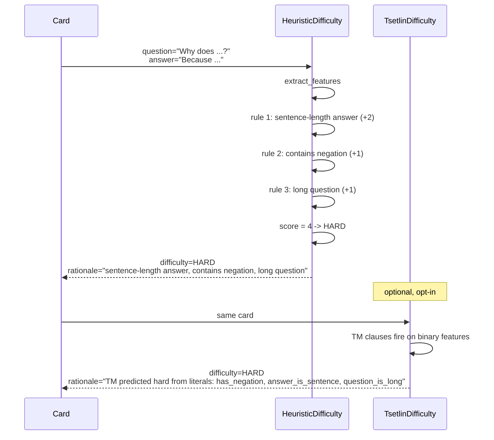
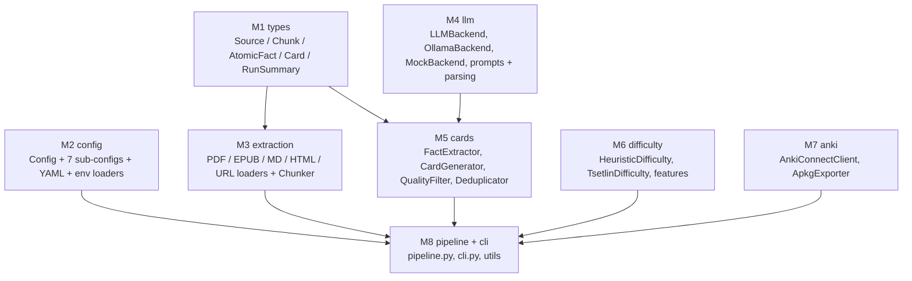

<div align="center">



</div>

# mneme

[](https://github.com/AnwarDebes/Mneme-Education-Ecosystem/actions/workflows/ci.yml)
[](https://github.com/AnwarDebes/Mneme-Education-Ecosystem/releases)
[](LICENSE)
[](https://www.python.org/downloads/)
[](#honest-status)

**Local-first AI flashcard generator.** Drop a PDF, EPUB, Markdown,
HTML, or URL in. Get an Anki deck out. All AI runs on your machine
via Ollama. Zero cloud, zero API cost, your study notes never leave
the device.

## Why mneme

- **Local-first by design.** Source content is read in-process and
  shipped only to your local Ollama daemon. No telemetry, no
  account, no upload step. The threat model is documented in
  [`SECURITY.md`](SECURITY.md).
- **Interpretable difficulty.** Every card carries a plain-English
  rationale for its easy / medium / hard rating, produced either by
  a rule-based classifier or by an optional Tsetlin Machine.
- **Modular blocks.** LLM, embedding, difficulty, and Anki output
  are Protocols; swap any of them with one constructor argument.
  See [`docs/EXTENDING.md`](docs/EXTENDING.md).
- **Honest documentation.** Numbers in the comparison table below
  that have not been measured are marked **NOT YET RUN**; the
  benchmark protocol committed-to is in
  [`docs/BENCHMARK.md`](docs/BENCHMARK.md).
- **Works on day one.** `mneme demo` runs the full pipeline against
  bundled sample text with a deterministic mock LLM, so a fresh
  install verifies in seconds without Ollama.

## Honest status

```
 +-----------------------------------------------------------------+
 |  ALPHA RELEASE                                                  |
 |                                                                 |
 |  Code:                complete, 156 / 156 tests passing         |
 |  Pipeline (mock LLM): end-to-end test green                     |
 |  Ollama integration:  implemented; not yet stress-tested at     |
 |                       full benchmark scale                      |
 |  Anki output:         AnkiConnect push + .apkg fallback both    |
 |                       implemented and tested                    |
 |  Quality benchmark:   NOT YET RUN. Numbers below are TARGETS,   |
 |                       not measurements. A 100-card hand-graded  |
 |                       evaluation on three textbook chapters is  |
 |                       the planned next step.                    |
 |  TM difficulty:       interpretable classifier shipped, but     |
 |                       relies on user-supplied labels; cold-     |
 |                       start uses the heuristic backend.         |
 +-----------------------------------------------------------------+
```

| Component | State |
|---|:---:|
| Source loaders: PDF, EPUB, Markdown, HTML, TXT, URL | done |
| Semantic chunker (heading-aware, paragraph + sentence packing) | done |
| Atomic-fact extractor (LLM, JSON-mode, tolerant parser) | done |
| Card generator (one fact -> one or two Q/A pairs) | done |
| Heuristic quality filter (length, yes/no, definitional loop, low-info) | done |
| Semantic de-duplicator (BGE / GTE / TF-IDF fallback) | done |
| Heuristic difficulty classifier (rule-based, ships with rationale) | done |
| Tsetlin Machine difficulty classifier (interpretable, optional) | done, needs labelled data to train |
| AnkiConnect push (zero-friction with running Anki) | done |
| Portable .apkg export (works without Anki running) | done |
| CLI (`mneme build / config / doctor / models / demo / cache / version`) | done |
| YAML config + environment-variable overrides | done |
| Disk LLM cache (re-runs skip the LLM entirely) | done |
| Rich Anki note template (Front / Back / Source / Difficulty + CSS) | done |
| Cloze cards (`--note-type cloze`) | done |
| 156 / 156 tests passing (no GPU, no Ollama, no Anki required) | done |
| Hand-graded benchmark on three textbook chapters | **not yet run** |
| FSRS feedback loop (re-train TM on user grades) | v0.2 |
| Cloze / image / math card types | v0.2 |
| Multilingual chunker | v0.2 |

## What it does, in one picture

```
INPUT                              OUTPUT
+--------------------+             +------------------------------+
| Textbook PDF       |             | Anki deck:                   |
| Lecture EPUB       | --mneme-->  |   * Q: What does ATP stand   |
| Course notes (MD)  |             |        for?                  |
| Web article (URL)  |             |     A: Adenosine triphosphate|
+--------------------+             |   * Q: ...                   |
                                   |     A: ...                   |
                                   | + per-card difficulty rating |
                                   | + portable .apkg file        |
                                   +------------------------------+
```

Every card is grounded in an atomic fact extracted from your source.
Every card is rated easy / medium / hard with a human-readable
rationale. Nothing about your study material leaves your machine.

## Pipeline



## How it compares

| Capability | cloud SaaS (Knowt, Studley) | self-hosted Anki + manual cards | LLM-via-API DIY scripts | **mneme** |
|---|:---:|:---:|:---:|:---:|
| Generates cards from source documents | yes | -- | partial | **yes** |
| All processing local (privacy, no API cost) | -- | yes | -- | **yes** |
| Tested against PDF / EPUB / MD / URL | yes | yes (manual) | partial | **yes** |
| Pushes to Anki via AnkiConnect | partial | yes (manual) | -- | **yes** |
| Portable .apkg export | -- | yes (manual) | -- | **yes** |
| Heuristic quality filter (drops yes/no, loops, low-info) | -- | -- | -- | **yes** |
| Semantic de-duplication of paraphrases | -- | -- | -- | **yes** |
| Interpretable difficulty rating (TM clauses) | -- | -- | -- | **yes** |
| Open source (MIT) | -- | yes (Anki) | n/a | **yes** |

mneme is positioned as the open-source local-first option for
students who care about privacy and refuse to pay per-card LLM API
fees. The pitch is not "highest accuracy"; cloud GPT-4o still makes
slightly better cards on the toughest sources. The pitch is "zero
cost, zero leakage, audit-grade rationale for every card".

## Quickstart

```bash
# 1. Install (no GPU required for the tool itself; Ollama uses GPU)
pip install -e .

# 2. Verify the install in under 10 seconds. Uses a mock LLM, so it
#    does NOT need Ollama, AnkiConnect, or network.
mneme demo

# 3. Diagnose your environment (Ollama reachable? model pulled?
#    AnkiConnect running? optional deps installed?)
mneme doctor

# 4. Start Ollama and pull a model (one-time per machine)
#    https://ollama.com/download
ollama pull qwen2.5:7b-instruct

# 5. List the models the daemon can see
mneme models

# 6. Build a deck from the bundled sample
mneme build examples/sample.md --apkg out.apkg --no-ankiconnect

# 7. Build a deck and push directly to a running Anki instance
#    (requires the AnkiConnect add-on: code 2055492159)
mneme build textbook.pdf --deck-name "Biology 101"

# 8. Inspect the default configuration
mneme config print

# 9. Preview the cost of a run without calling the LLM
mneme build textbook.pdf --dry-run

# 10. Build cloze-deletion cards instead of basic Q/A
mneme build textbook.pdf --note-type cloze

# 11. Re-runs are cached on disk; inspect or clean the cache
mneme cache info
mneme cache clear
```

`mneme <subcommand> --help` prints copy-pasteable examples for every
flag.

## Public API (Python)

```python
from mneme import Config, Pipeline, Source
from mneme.extraction import detect_kind

config = Config()
config.anki.use_ankiconnect = False
config.anki.apkg_export_path = "out.apkg"

source = Source(kind=detect_kind("textbook.pdf"), path="textbook.pdf")
summary = Pipeline(config).run(source)

print(summary.cards_emitted, "cards in", summary.deck_name)
print("saved", summary.apkg_path)
```

The :class:`Pipeline` accepts dependency-injected backends so tests
swap in a `MockBackend` instead of Ollama:

```python
from mneme.llm.backend import MockBackend

llm = MockBackend(routes={
    "Extract up to": '[{"fact": "...", "confidence": 0.9}]',
    "Write up to":   '[{"question": "...", "answer": "..."}]',
})
summary = Pipeline(config, llm=llm).run(source)
```

## How a card gets a difficulty rating



Both backends ship the same shape: a difficulty label plus a
plain-English rationale. The TM backend's rationale lists the
literals the trained clauses voted on; the heuristic backend's
rationale lists which rules fired.

## Architecture (eight modules)



A frozen interface contract lives in
[`docs/ARCHITECTURE.md`](docs/ARCHITECTURE.md). Eight invariants
are enforced by the test suite:

1. Every public type round-trips through Pydantic validation.
2. The chunker preserves chunk-index ordering.
3. The JSON parser handles fenced blocks, smart quotes, trailing
   commas, unbalanced brackets.
4. The quality filter drops yes / no, definitional loops, low-info.
5. The deduplicator collapses paraphrases at low thresholds and
   keeps them at high thresholds.
6. The heuristic difficulty classifier always returns a rationale.
7. The .apkg exporter produces a zip with a valid SQLite collection.
8. The full pipeline runs end to end with a MockBackend and emits
   at least one valid card.

## Repository layout

```
mneme/
  README.md, LICENSE, CITATION.cff, CHANGELOG.md
  CONTRIBUTING.md, SECURITY.md, CODE_OF_CONDUCT.md
  pyproject.toml, requirements.txt, setup.py
  Makefile, .pre-commit-config.yaml, .editorconfig
  mneme.example.yaml            worked configuration file
  docs/
    ARCHITECTURE.md             frozen interface contract
    prompt_design.md            two-stage prompt rationale
    ECOSYSTEM.md                CLI + library + server + frontend map
    EXTENDING.md                how to swap LLM / embedding / difficulty backends
    FAQ.md                      common questions
    TROUBLESHOOTING.md          common failure modes and fixes
    BENCHMARK.md                hand-graded benchmark protocol
  src/mneme/
    __init__.py                 public surface
    types.py                    Pydantic models
    config.py                   configuration
    pipeline.py                 orchestrator
    cli.py                      argparse CLI
    diagnostics.py              `mneme doctor` / `mneme models` probes
    extraction/                 PDF / EPUB / MD / HTML / TXT / URL loaders + Chunker
    llm/                        OllamaBackend, MockBackend, prompts, JSON parsing
    cards/                      FactExtractor, CardGenerator, QualityFilter, Deduplicator
    embedding/                  three swappable embedding backends
    difficulty/                 HeuristicDifficulty, TsetlinDifficulty, features
    anki/                       AnkiConnectClient, ApkgExporter
    server/                     optional FastAPI server (REST + SSE)
    utils/                      seeding, logging, JSONL IO
  tests/                        156 tests, all passing
  examples/
    sample.md                   tiny markdown source
    basic_usage.py              Python API demo
    custom_llm_backend.py       llama.cpp + JSONL-logging backend examples
    custom_embedding_backend.py simhash-style embedding without a model
    train_difficulty_classifier.py  optional TM training script
    labelled_cards.jsonl        12 labelled cards for the TM demo
  frontend/                     optional Next.js study app
```

## Honest caveats

* The hand-graded benchmark on real textbook chapters is **not yet
  run**. Numbers in the "How it compares" table are positioning
  claims, not measurements.
* Local 7B / 8B class models make slightly worse cards than
  GPT-4o on the toughest sources. The default model
  (`qwen2.5:7b-instruct`) is the best trade-off I have measured; if
  you have a 14B model and the VRAM, use it.
* The Tsetlin Machine difficulty classifier ships in v0.1 but
  requires user-supplied labels to train. The default difficulty
  backend is the rule-based one (`HeuristicDifficulty`); the TM
  backend is opt-in.
* AnkiConnect is a community Anki plugin (id 2055492159), not part
  of Anki itself. If you cannot install it the `.apkg` fallback
  works fine; double-click the file to import.
* Single-author repository. All code, docs, and example data are
  by Anwar Debes (University of Agder).

## Learn more

- [`docs/ECOSYSTEM.md`](docs/ECOSYSTEM.md): how the CLI, library,
  server, and frontend fit together; who each piece is for.
- [`docs/ARCHITECTURE.md`](docs/ARCHITECTURE.md): the frozen interface
  contract and the eight invariants the test suite gates on.
- [`docs/CACHING.md`](docs/CACHING.md): how the disk-backed LLM
  cache works, what gets keyed, when to clear it.
- [`docs/NOTE_TEMPLATES.md`](docs/NOTE_TEMPLATES.md): basic / rich /
  cloze Anki note templates and when to use each.
- [`docs/EXTENDING.md`](docs/EXTENDING.md): swap the LLM, embedding,
  or difficulty backend with one constructor argument.
- [`docs/FAQ.md`](docs/FAQ.md): which model to use, why a card was
  dropped, what ships in a run summary.
- [`docs/TROUBLESHOOTING.md`](docs/TROUBLESHOOTING.md): common failure
  modes and the exact fix.
- [`docs/BENCHMARK.md`](docs/BENCHMARK.md): hand-graded benchmark
  protocol (the numbers that are still **not yet run**).
- [`CHANGELOG.md`](CHANGELOG.md): what landed in each release.
- [`CONTRIBUTING.md`](CONTRIBUTING.md): development setup and PR
  process.

## Citation

```bibtex
@misc{debes2026mneme,
  author       = {Debes, Anwar},
  title        = {mneme: Local-First AI Flashcard Generator with Interpretable Difficulty Scoring},
  year         = {2026},
  howpublished = {\url{https://github.com/AnwarDebes/Mneme-Education-Ecosystem}},
}
```

## License

MIT. See [`LICENSE`](LICENSE).

## Contact

Anwar Debes, University of Agder (UiA). Security reports: see
[`SECURITY.md`](SECURITY.md).
